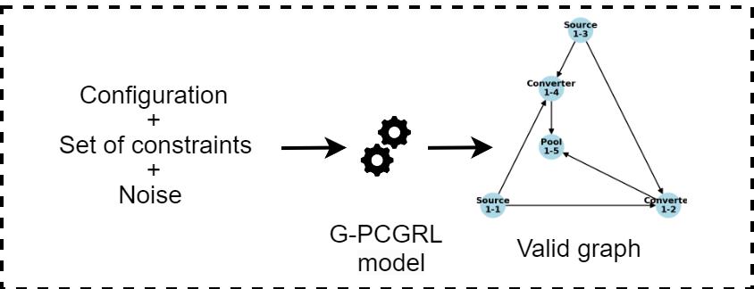

# G-PCGRL: Procedural Graph Data Generation via Reinforcement Learning

This is the code base for the conference paper of the same name, to be published in the proceedings of the IEEE Conference on Games 2024.

### TL;DR;
* G-PCGRL is a controllable approach to using [PCGRL](https://cdn.aaai.org/ojs/7416/7416-52-10717-1-2-20200923.pdf)  to generate graph data by manipulating a graph’s
adjacency matrix.
  * Therefore, we create the graph-narrow and graph-wide representation.
* Valid graphs are defined by sets of constraints. Each model is trained on such a set of constraints.
* Models are controllable in terms of the size of the graph and the types of nodes in the graph.
* Since it is less dependent on randomness than other methods (e.g., hill climbing, evolutionary algorithm), G-PCGRL is fast and robust in generating content.

<div style="text-align:center;">
    
</div>


## Demo

For a little demo on how to control a trained model to generate a graph for a set of constraints see the ``demo.ipynb`` Jupyter notebook.


## Limitations
* Generation of larger graphs is limited. To generate larger graphs we recommend the concatenation of subgraphs generated by a model but with e.g. different
configurations. See paper for details.
* At the moment, the constraint definition is very simple. Only positive lists are possible, for instance it is not possible to define min/max connection per node type.


## Future work

* Extend scaling of the method (e.g. use CNN or GNN layers for feature extraction).
* Experiment with further definitions of constraints to extend the constraint modeling opportunities.


## Bibliography

If you use this code, please use this for citations:

```
Coming soon.
```


### Used code

#### Khalifa et al.: Pcgrl: Procedural Content Generation via Reinforcement Learning.

* The code in ```/gym_pcgrl``` is partially taken from the original code base [here](https://github.com/amidos2006/gym-pcgrl) (MIT License).
* For this research it has been extended and adjusted.

```
@inproceedings{khalifa_pcgrl_2020,
	title = {Pcgrl: {Procedural} content generation via reinforcement learning},
	volume = {16},
	booktitle = {Proceedings of the {AAAI} {Conference} on {Artificial} {Intelligence} and {Interactive} {Digital} {Entertainment}},
	author = {Khalifa, Ahmed and Bontrager, Philip and Earle, Sam and Togelius, Julian},
	year = {2020},
	pages = {95--101},
}
```